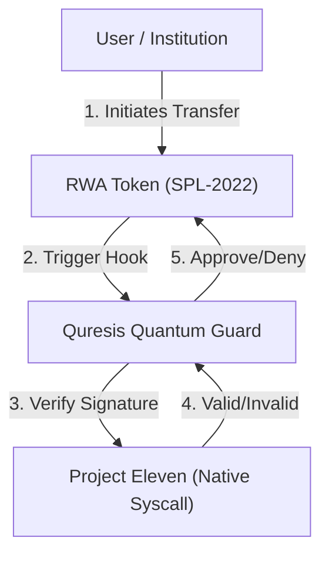

# Quresis Protocol

**The Post-Quantum Security Standard for Real World Assets (RWA) on Solana.**

[](https://youtu.be/5SOVC5c9xUg)
[](LICENSE)
[](https://solana.com)
[](https://github.com/solana-labs)
[](https://explorer.solana.com/address/7SwY7dD2rQTvWs8KUB1xsy3GuUbKBoJdcPvx8kGiuojv?cluster=devnet)
[](https://www.anchor-lang.com/)

> **Program IDs (Devnet):**
> - `quresis`: `7SwY7dD2rQTvWs8KUB1xsy3GuUbKBoJdcPvx8kGiuojv`
> - `quresis-hook`: `9P6cDkGwt3AADtVtFLy3nCHz3ZDLnMLpscUmVFqosvB4`

---

## 🛡️ Introduction

**Quresis** is the first application-layer security framework designed to operationalize Solana's emerging **Post-Quantum Cryptography (PQC)** primitives via native SVM syscalls for the institutional market.

As Solana matures into the global execution layer for **Internet Capital Markets (ICM)**, trillions of dollars in long-duration assets—such as tokenized bonds, real estate, and equity—will be brought on-chain. These assets, with lifecycles spanning decades, are vulnerable to "Harvest Now, Decrypt Later" attacks by future quantum computers.

Quresis bridges the gap between raw protocol cryptography (ML-DSA) and developer usability. We provide the **"Quantum Guard"** via SPL-2022 Transfer Hooks, enabling asset issuers to mandate quantum-resistant signatures for high-value transactions without altering the core user experience.

---

## ⚡ Core Value Proposition

### 1. Native SVM Integration (Zero-Copy)
Instead of implementing heavy, custom cryptography in user space (which consumes excessive Compute Units), Quresis is architected to leverage Solana's upcoming **Native ML-DSA Syscalls**. This design ensures our protocol remains lightweight and aligned with the official Solana roadmap for quantum resistance.

### 2. The RWA Quantum Guard (SPL-2022)
We utilize **Token Extensions (Transfer Hooks)** to create a compliance layer for assets.
* **Small Tx (<$100):** Standard Ed25519 signature (Fast, Low Friction).
* **Large Tx (>$10k):** Requires **Ed25519 + ML-DSA** Dual Signature.
* **Result:** Institutional-grade security with consumer-grade usability.

### 3. Drop-in Anchor Integration
Developers do not need to be cryptographers. Quresis exposes simple Anchor macros to secure Program Derived Addresses (PDAs) and Token Mints.

---

## 🏗️ Technical Architecture

Quresis acts as the orchestration layer between the Solana Runtime and User Programs.



### Repository Structure
 * quresis-core: Rust interfaces for interacting with Solana's native PQC syscalls.
 * quresis-hook: Reference implementation of an SPL-2022 Transfer Hook enforcing quantum checks.
 * quresis-anchor: A set of Rust macros and traits for easy integration into Anchor programs.
## 💻 Developer Preview
(Concept Code: How developers will use Quresis)

```rust
use quresis_anchor::prelude::*;

#[program]
pub mod my_rwa_vault {
    use super::*;

    // Automatically enforce ML-DSA signature check
    #[access_control(Quresis::verify_quantum_sig(&ctx))] 
    pub fn withdraw_assets(ctx: Context<Withdraw>, amount: u64) -> Result<()> {
        // Business logic...
        Ok(())
    }
}
```

## 🗺️ Roadmap
### Phase 1: The Foundation (Current)
 * [x] Analysis of Solana's native ML-DSA implementation and upcoming syscalls.
 * [x] Development of `quresis` core program for Anchor.
 * [ ] Benchmarking CU costs for hybrid verification.
### Phase 2: The Guard (Grant Milestone)
 * [ ] Deployment of the `quresis-hook` Transfer Hook program on Devnet.
 * [ ] "Quantum RWA" Demo: A tokenized asset that requires dual-signing for transfers.
### Phase 3: Standardization
 * [ ] Release of TypeScript SDK for off-chain ML-DSA key generation.
 * [ ] Proposal for a standard "Quantum Identity" PDA layout for Solana users.

## 🤝 Contributing
Quresis is an open-source standard. We welcome contributions from Rust developers, cryptographers, and institutional partners interested in piloting quantum-safe assets.

## 📄 License
This project is licensed under the Apache 2.0 License
.
<p align="center">
Built with 🦀 and ⚛️ for the Solana Ecosystem.
</p>
