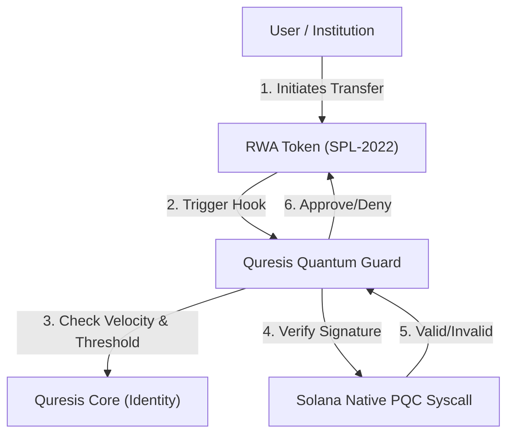

# Quresis Protocol

**The Post-Quantum Security Standard for Real World Assets (RWA) on Solana.**

[](https://youtu.be/5SOVC5c9xUg)
[](LICENSE)
[](https://solana.com)
[](https://github.com/solana-labs)
[](https://explorer.solana.com/address/7SwY7dD2rQTvWs8KUB1xsy3GuUbKBoJdcPvx8kGiuojv?cluster=devnet)
[](https://www.anchor-lang.com/)
[](./tests)

> **Program IDs (Devnet):**
> - `quresis`: `7SwY7dD2rQTvWs8KUB1xsy3GuUbKBoJdcPvx8kGiuojv`
> - `quresis-hook`: `9P6cDkGwt3AADtVtFLy3nCHz3ZDLnMLpscUmVFqosvB4`

---

## 🛡️ Introduction

**Quresis** is the first application-layer security framework designed to operationalize Solana's emerging **Post-Quantum Cryptography (PQC)** primitives via native SVM syscalls for the institutional market.

As Solana matures into the global execution layer for **Internet Capital Markets (ICM)**, trillions of dollars in long-duration assets—such as tokenized bonds, real estate, and equity—will be brought on-chain. These assets, with lifecycles spanning decades, are vulnerable to "Harvest Now, Decrypt Later" attacks by future quantum computers.

Quresis bridges the gap between raw protocol cryptography (ML-DSA) and developer usability. We provide the **"Quantum Guard"** via SPL-2022 Transfer Hooks, enabling asset issuers to mandate quantum-resistant signatures for high-value transactions without altering the core user experience.

---

## ⚡ Core Value Proposition

### 1. Native SVM Integration (Zero-Copy)
Instead of implementing heavy, custom cryptography in user space (which consumes excessive Compute Units), Quresis is architected to leverage Solana's upcoming **Native ML-DSA Syscalls** (such as those being pioneered by *Project Eleven*). This design ensures our protocol remains lightweight and aligned with the official Solana roadmap for quantum resistance.

### 2. The RWA Quantum Guard (SPL-2022)
We utilize **Token Extensions (Transfer Hooks)** to create a compliance layer for assets.
* **Small Tx (<$10k):** Standard Ed25519 signature (Fast, Low Friction).
* **Large Tx (>$10k):** Requires **Ed25519 + ML-DSA** Dual Signature.
* **Anti-Smurfing (Velocity Limits):** Prevents attackers from bypassing thresholds by aggregating transfer volumes over a 24-hour rolling window.

### 3. Drop-in Anchor Integration
Developers do not need to be cryptographers. Quresis exposes simple Anchor macros to secure Program Derived Addresses (PDAs) and Token Mints.

---

## 🏗️ Technical Architecture

Quresis acts as the orchestration layer between the Solana Runtime and User Programs.


```mermaid
graph TD
    User["User / Institution"] -->|1. Initiates Transfer| Token["RWA Token (SPL-2022)"]
    Token -->|2. Trigger Hook| Guard["Quresis Quantum Guard"]
    Guard -->|3. Check Velocity & Threshold| QuresisCore["Quresis Core (Identity)"]
    Guard -->|4. Verify Signature| Syscall["Solana Native PQC Syscall"]
    Syscall -->|5. Valid/Invalid| Guard
    Guard -->|6. Approve/Deny| Token
```

### Repository Structure
```
quresis-core/
├── programs/
│   ├── quresis/          # Core Quantum Identity registry & Velocity Tracker
│   └── quresis-hook/     # SPL-2022 Transfer Hook (The Guard)
├── sdk/                  # TypeScript SDK (@quresis/sdk)
│   ├── src/              # Source code
│   ├── dist/             # Built output
│   └── README.md         # SDK documentation
└── tests/                # Comprehensive Anchor test suite (28 tests)
```

### Key Features
- **Quantum Identity PDA**: Links Solana wallet with ML-DSA public key.
- **Velocity Tracking (Anti-Smurfing)**: Aggregates transfer amounts over 24-hour windows to prevent threshold circumvention.
- **Zero-Copy Parsing**: Reads states efficiently to minimize Compute Unit (CU) consumption.
- **Three Enforcement Modes**: Disabled, SoftEnforce, HardEnforce.

---

## 📦 TypeScript SDK

Install the SDK for off-chain ML-DSA key generation:

```bash
npm install @quresis/sdk
```

```typescript
import { QuresisKeyPair, QuresisSigner } from '@quresis/sdk';

// Generate ML-DSA-44 keypair (NIST Level 2)
const keypair = QuresisKeyPair.generate('ML-DSA-44');
console.log(`Public key: ${keypair.publicKey.length} bytes`); // 1312

// Sign a message
const signer = new QuresisSigner(keypair);
const message = new TextEncoder().encode('Transfer 1000 tokens');
const signature = await signer.sign(message);
console.log(`Signature: ${signature.bytes.length} bytes`); // 2420
```

See [SDK README](./sdk/README.md) for full documentation.

---

## 🗺️ Roadmap

### Phase 1: The Foundation ✅
- [x] Analysis of Solana's native ML-DSA implementation and upcoming syscalls
- [x] Development of `quresis` core program for Anchor
- [x] TypeScript SDK for off-chain ML-DSA key generation
- [x] Discriminator safety checks for cross-program data validation

### Phase 2: The Guard ✅
- [x] "Quantum RWA" Demo: A tokenized asset that requires dual-signing for transfers
- [x] Deployment of `quresis-hook` Transfer Hook program on Devnet
- [x] On-chain anti-smurfing (velocity tracking via CPI)
- [x] Comprehensive test suite (28 tests passing)

### Phase 3: Consumer Integration (In Progress)
- [ ] Frontend demonstration application / dApp Dashboard
- [ ] User-friendly wallet connection and registration flow
- [ ] RWA management portal for Token Authorities

### Phase 3: Standardization
- [ ] Proposal for a standard "Quantum Identity" PDA layout for Solana users
- [ ] Security audit and mainnet deployment
- [ ] Integration guides for major RWA platforms

---

## 🚀 Quick Start

```bash
# Clone the repository
git clone https://github.com/Quresis-Protocol/quresis-core.git
cd quresis-core

# Install dependencies
yarn install

# Build the programs
anchor build

# Run tests (localnet)
anchor test
```

---

## 🤝 Contributing

Quresis is an open-source standard. We welcome contributions from Rust developers, cryptographers, and institutional partners interested in piloting quantum-safe assets.

## 📄 License

This project is licensed under the Apache 2.0 License.

<p align="center">
Built with 🦀 and ⚛️ for the Solana Ecosystem.
</p>

